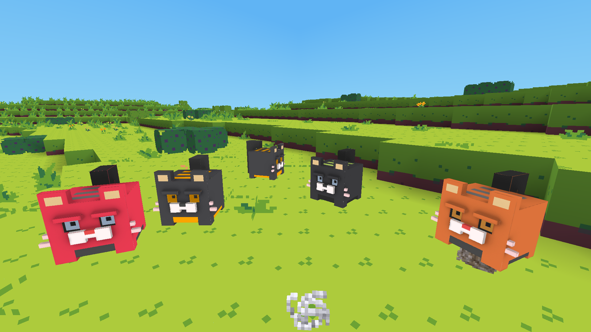

# mt-pretty-cats
Mintest mod, which adding pretty cats to your world

# Usage
Unpack to ~/.minetest/mods/ folder

# Depends
mobs

# Known problems
1. Gaps at mesh seams
2. Cats lighting in darkness(it's really problem?)
3. Model has many polygons, textures so large. Need retopology mesh for increase count of polygons and make pixel-texture with saving ambient occlusion.

## Screenshots

